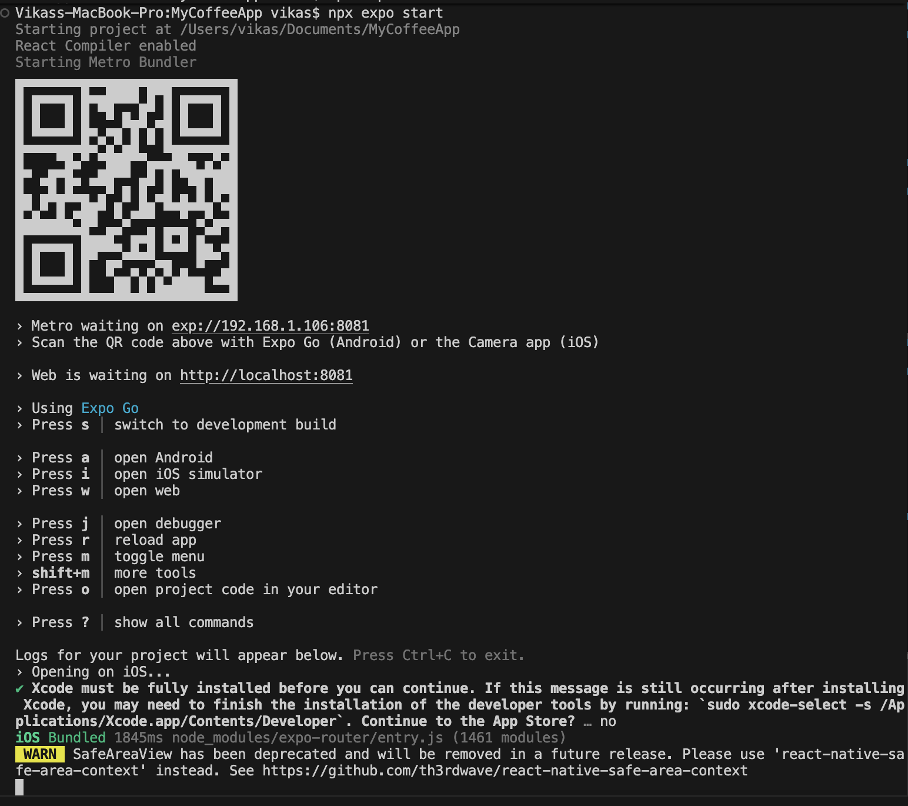

# MyCoffeeApp

MyCoffeeApp is a modern mobile application built with Expo and React Native, designed to help users explore, discover, and enjoy coffee experiences. The app features a clean UI, interactive components, and seamless navigation.

## Features
- Explore coffee shops and experiences
- Interactive tabs and modal views
- Parallax scrolling and collapsible UI elements
- Themed views and text for light/dark mode
- Haptic feedback for enhanced user interaction

## Project Structure
```
app/
   - Main app screens and layouts
components/
   - Reusable UI components
constants/
   - Theme and configuration files
hooks/
   - Custom React hooks
assets/
   - Images and static assets
scripts/
   - Utility scripts
```

## Getting Started

### Prerequisites
- Node.js (v16 or later)
- npm or yarn
- Expo CLI (`npm install -g expo-cli`)

### Installation
1. Clone the repository:
    ```bash
    git clone <repo-url>
    cd MyCoffeeApp
    ```
2. Install dependencies:
    ```bash
    npm install
    # or
    yarn install
    ```

### Running the App
1. Start the Expo development server:
    ```bash
    expo start
    ```
2. Use the Expo Go app on your device or an emulator to preview the app.
3. Both iphone and laptop should be on the same wifi
4. You can the QR code to run the app on your phone.



## Project Scripts
- `npm run reset`: Resets the project using the script in `scripts/reset-project.js`.

## Folder Overview
- `app/`: Main application screens and layouts
- `components/`: UI components and utilities
- `constants/`: Theme and configuration
- `hooks/`: Custom hooks for color scheme and theme
- `assets/`: Images and other static assets
- `scripts/`: Project utility scripts

## Contributing
Pull requests are welcome. For major changes, please open an issue first to discuss what you would like to change.

## License
This project is licensed under the MIT License.

- [development build](https://docs.expo.dev/develop/development-builds/introduction/)
- [Android emulator](https://docs.expo.dev/workflow/android-studio-emulator/)
- [iOS simulator](https://docs.expo.dev/workflow/ios-simulator/)
- [Expo Go](https://expo.dev/go), a limited sandbox for trying out app development with Expo

You can start developing by editing the files inside the **app** directory. This project uses [file-based routing](https://docs.expo.dev/router/introduction).

## Get a fresh project

When you're ready, run:

```bash
npm run reset-project
```

This command will move the starter code to the **app-example** directory and create a blank **app** directory where you can start developing.

## Learn more

To learn more about developing your project with Expo, look at the following resources:

- [Expo documentation](https://docs.expo.dev/): Learn fundamentals, or go into advanced topics with our [guides](https://docs.expo.dev/guides).
- [Learn Expo tutorial](https://docs.expo.dev/tutorial/introduction/): Follow a step-by-step tutorial where you'll create a project that runs on Android, iOS, and the web.

## Join the community

Join our community of developers creating universal apps.

- [Expo on GitHub](https://github.com/expo/expo): View our open source platform and contribute.
- [Discord community](https://chat.expo.dev): Chat with Expo users and ask questions.
